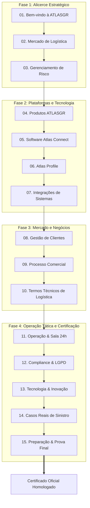
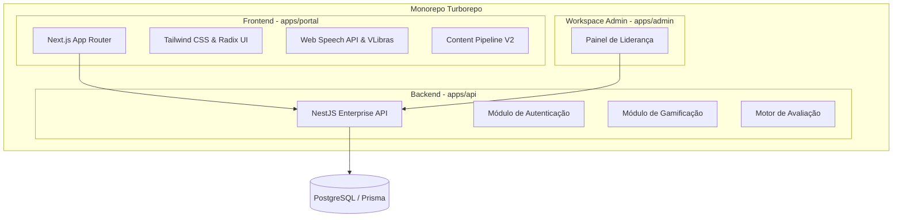
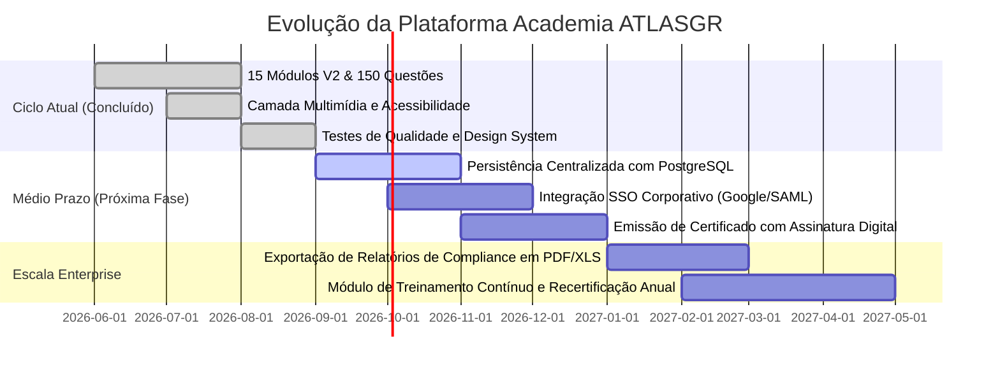

# Briefing Executivo: Academia ATLASGR & Plataforma de Capacitação Corporativa


---

## 1. Sumário Executivo & Visão Estratégica

A **Academia ATLASGR** é a plataforma corporativa de aprendizagem, onboarding tático e validação de domínio técnico da ATLASGR. Concebida sob o padrão visual e arquitetural de um **"Corporate Command Center"**, a plataforma resolve um gargalo histórico do setor de gerenciamento de riscos logísticos: **substituir o treinamento passivo por um modelo de decisão aplicada**.

> [!IMPORTANT]
> **Princípio Central do Produto:**
> *"O melhor treinamento não é o que o colaborador conclui rapidamente. É o que transforma positivamente a próxima decisão tomada sob pressão na operação."*

### Indicadores-Chave de Desempenho do Programa (KPIs)

| Indicador | Dimensão / Valor | Impacto Operacional |
| :--- | :--- | :--- |
| **Currículo Ativo V2** | **15 Módulos Especializados** | Cobre desde a cultura institucional e mercado até a Sala de Guerra 24h e PGR dinâmico |
| **Banco Avaliativo** | **150 Questões Cenarizadas** | 10 questões situacionais por módulo, com feedback pedagógico e alçada de decisão |
| **Laboratórios Práticos** | **15 Practice Labs** | Missão real, cenário de risco, critérios de excelência e pergunta de transferência para a rotina |
| **Trilhas Personalizadas** | **5 Trilhas por Função** | Direcionamento sob medida para Comercial, Operações/Central, Tecnologia, Gestão e Formação Essencial |
| **Cobertura e Homologação** | **+35 Tecnologias Integradas** | Telemetria, sensores IoT e rastreadores multitecnologia homologados |
| **Critério de Certificação** | **Mínimo 70% de Domínio** | Validação rigorosa para emissão do Certificado Oficial de Especialista Homologado |

---

## 2. Acervo Executivo de Vídeos da Plataforma

A plataforma integra mídias institucionais e técnicas diretamente no fluxo de aprendizagem (com modo estrito de privacidade, transcrição de apoio e foco em operações reais):

### 2.1. Vídeo Institucional ATLASGR — Gerenciamento de Risco & Central 24/7
- **Conteúdo:** Apresentação da infraestrutura nacional da ATLASGR, Central de Inteligência 24/7/365, monitoramento de frotas e metodologia preventiva em Gerenciamento de Risco (PGR).
- **Mídia Oficial:** [Assistir no YouTube: Conheça a ATLASGR](https://www.youtube.com/watch?v=yALfdQPaPi4)
- **ID Oficial do Vídeo:** `yALfdQPaPi4`
- **Aplicação no Curso:** Integrado no Módulo 01 (*Bem-vindo à ATLASGR*) e no Hero de mídia da Academia.

### 2.2. Vídeo Oficial Atlas Profile — Cadastro, Validação & LGPD
- **Conteúdo:** Demonstração do ecossistema Atlas Profile para análise cadastral, validação biométrica e background check securitário de motoristas rodoviários em estrita conformidade com a LGPD.
- **Mídia Oficial:** [Assistir no YouTube: Atlas Profile](https://www.youtube.com/watch?v=_4MuQMIiSTY)
- **ID Oficial do Vídeo:** `_4MuQMIiSTY`
- **Aplicação no Curso:** Integrado no Módulo 06 (*Atlas Profile & Compliance Cadastral*).

### 2.3. Canal Oficial de Treinamento e Comunicação
- **Canal ATLASGR:** [YouTube Oficial @atlasgroficial](https://www.youtube.com/@atlasgroficial)
- **Roteiros de Demonstração e Apresentação do LMS:** Disponíveis na documentação técnica em `documentacao-aplicacao/roteiros/`.

---

## 3. Jornada Visual do Usuário no Portal (LMS)

A jornada do colaborador foi estruturada para garantir imersão imediata, acompanhamento transparente e suporte contínuo.

````carousel

<!-- slide -->

<!-- slide -->

<!-- slide -->

<!-- slide -->

<!-- slide -->

<!-- slide -->

<!-- slide -->

<!-- slide -->

````

---

## 4. Ecossistema Tecnológico Real: Sistemas Operados

O grande diferencial pedagógico da Academia ATLASGR é conectar o conteúdo instrucional às telas e sistemas que o operador utilizará na Central 24h e na rotina com clientes.

### 4.1. Atlas Connect & NewConnect (Central de Telemetria e Monitoramento)

````carousel

<!-- slide -->

<!-- slide -->

<!-- slide -->

````

- **Atlas Connect Plus:** Visão unificada das apólices de seguro, regras do Plano de Gerenciamento de Riscos (PGR) e status operacional de cada frota.
- **NewConnect:** Central de telemetria preditiva com monitoramento de velocidade, fadiga, temperatura de carga frigorificada e desvio de trajeto.
- **Protocolo de Alerta Crítico:** Interface tática onde o operador executa checagens de redundância, comunicação tática com o motorista e acionamento de forças de pronta resposta.

### 4.2. Atlas Profile (Inteligência Cadastral e Securitária)

````carousel

<!-- slide -->

````

- **Diferenciação Crítica:** O treinamento ensina a separar rigorosamente **Dado**, **Análise** e **Decisão**.
- **Conformidade Legal:** Treinamento específico sobre tratamento ético de dados pessoais (LGPD), evitando vieses ou reprovações sem base documental auditável.

---

## 5. Estrutura Curricular V2: 15 Módulos e 5 Trilhas

O currículo V2 foi completamente revisado para eliminar generalismos e focar em casos e decisões operacionais.



### 5.1. Quadro Geral dos 15 Módulos

| Nº | Módulo | Categoria | Carga Horária | Foco de Competência |
| :---: | :--- | :--- | :---: | :--- |
| **01** | Bem-vindo à ATLASGR | Fundamentos | 40 min | Propósito institucional, 5 valores e postura de dono |
| **02** | Mercado de Logística | Fundamentos | 35 min | Supply chain, atores do setor e pontos de vulnerabilidade |
| **03** | Gerenciamento de Risco | Fundamentos | 55 min | PGR dinâmico, apólices de seguros e prevenção na Central |
| **04** | Produtos ATLASGR | Soluções ATLASGR | 45 min | Diagnóstico de dores e portfólio completo de soluções |
| **05** | Software Logístico — Atlas Connect | Soluções ATLASGR | 50 min | Operação de telemetria, regras do PGR e gestão de viagens |
| **06** | Atlas Profile | Soluções ATLASGR | 35 min | Background check, biometria e compliance cadastral |
| **07** | Integrações de Sistemas | Soluções ATLASGR | 30 min | Arquitetura de APIs, TMS, ERPs e +35 rastreadores |
| **08** | Clientes | Mercado e Clientes | 30 min | Diferenças operacionais entre embarcadores e transportadores |
| **09** | Processo Comercial | Mercado e Clientes | 40 min | Venda consultiva, qualificação de ICP e quebra de objeções |
| **10** | Termos Técnicos | Excelência Operacional | 30 min | Tradução de jargões técnicos para linguagem operacional clara |
| **11** | Operação & Sala 24h | Excelência Operacional | 45 min | Gestão de incidentes em tempo real e pronta resposta |
| **12** | Compliance & LGPD | Excelência Operacional | 30 min | Privacidade de dados, sigilo operacional e limites de alçada |
| **13** | Tecnologia & Inovação | Excelência Operacional | 35 min | Motores neurais, IoT, telemetria preditiva e IA aplicada |
| **14** | Casos Reais | Excelência Operacional | 30 min | Estudo forense de sinistros e recuperação de cargas |
| **15** | Preparação Final | Conclusão | 30 min | Síntese de domínio, simulação prática e certificação oficial |

---

### 5.2. Detalhamento Individual dos 15 Módulos do Curso

#### Módulo 01: Bem-vindo à ATLASGR
* **Categoria:** Fundamentos • **Duração:** 40 minutos • **Status:** Homologado V2
* **Ementa:** História da ATLASGR (fundada em 2004), propósito organizacional, os 5 valores inegociáveis (*Perseverança, Transparência, Simplicidade, Atitude de Dono e Inovação*), estrutura organizacional e comunicação transparente.
* **Missão Prática (Practice Lab):** Construir uma explicação da ATLASGR de até 60 segundos conectando propósito, cultura corporativa e geração real de valor para a cadeia de transportes, sem recorrer a slogans genéricos.
* **Cenário de Decisão:** Um cliente ou parceiro questiona por que a ATLASGR é diferente de uma empresa que apenas vende rastreadores e software de mapa.
* **Competência Validada:** Separação entre fato e hipótese; comunicação institucional assertiva.

#### Módulo 02: Mercado de Logística
* **Categoria:** Fundamentos • **Duração:** 35 minutos • **Status:** Homologado V2
* **Ementa:** Visão sistêmica da cadeia de suprimentos (*Supply Chain*), ecossistema rodoviário nacional, diferenças de responsabilidade jurídica e operacional entre embarcadores, transportadoras terceirizadas e motoristas autônomos.
* **Missão Prática (Practice Lab):** Mapear o fluxo de uma viagem interestadual do Centro de Distribuição até a entrega final, identificando os 4 atores envolvidos e 3 pontos críticos de vulnerabilidade onde o risco nasce.
* **Cenário de Decisão:** Uma carga de alto valor precisa ser expedida em regime de urgência por uma transportadora subcontratada sem histórico de pontualidade.
* **Competência Validada:** Mapeamento de riscos e identificação de elos frágeis na logística.

#### Módulo 03: Gerenciamento de Risco (PGR)
* **Categoria:** Fundamentos • **Duração:** 55 minutos • **Status:** Homologado V2
* **Ementa:** Conceitos estruturais do Plano de Gerenciamento de Riscos (PGR Dinâmico), apólices securitárias de transporte de carga (RCTR-C, RC-DC), mitigação de sinistros, tecnologias de bloqueio e o papel estratégico da Central de Monitoramento.
* **Missão Prática (Practice Lab):** Tomar uma decisão tática preventiva antes que um conjunto de indícios se transforme em um sinistro consumado.
* **Cenário de Decisão:** Veículo carregado com carga visada apresenta desvio moderado de rota, parada em acostamento sem aviso e perda momentânea de sinal de satélite.
* **Competência Validada:** Classificação de risco em tempo real; aplicação rigorosa das Regras de Ouro do PGR.

#### Módulo 04: Produtos ATLASGR
* **Categoria:** Soluções ATLASGR • **Duração:** 45 minutos • **Status:** Homologado V2
* **Ementa:** Arquitetura do portfólio de soluções ATLASGR: gerenciamento de risco preventivo, consultoria dedicada, tecnologia proprietária, Atlas Connect, Atlas Profile e bases operacionais avançadas.
* **Missão Prática (Practice Lab):** Associar as dores reais de um cliente corporativo às soluções específicas do catálogo ATLASGR, estruturando a lógica da combinação sob a perspectiva de retorno sobre investimento (ROI) e redução de perdas.
* **Cenário de Decisão:** Embarcador multinacional enfrenta alto índice de fraudes cadastrais e pontos cegos em rotas secundárias no interior do país.
* **Competência Validada:** Diagnóstico consultivo centrado no problema operacional e securitário.

#### Módulo 05: Software Logístico — Sistema Atlas Connect
* **Categoria:** Soluções ATLASGR • **Duração:** 50 minutos • **Status:** Homologado V2
* **Ementa:** Navegação aprofundada no software Atlas Connect e Portal Atlas: painéis de telemetria, painéis de viagens, Solicitações de Monitoramento (SM), regras neurais automatizadas, envio de comandos e histórico auditável.
* **Missão Prática (Practice Lab):** Conduzir uma viagem completa dentro do sistema, desde a validação inicial do checklist até a identificação de um alerta e o registro de encerramento rastreável.
* **Cenário de Decisão:** O operador detecta discrepância entre o status de trava de baú informado pelo motorista e a telemetria do sensor no painel.
* **Competência Validada:** Rastreabilidade e domínio de operação em software de missão crítica.

#### Módulo 06: Atlas Profile & Inteligência Cadastral
* **Categoria:** Soluções ATLASGR • **Duração:** 35 minutos • **Status:** Homologado V2
* **Ementa:** Funcionamento do sistema Atlas Profile: consultas automatizadas de registros, background check securitário, validação de biometria facial, análise de consistência de dados e conformidade estrita com a LGPD.
* **Missão Prática (Practice Lab):** Analisar um dossiê cadastral com sinais de inconsistência sem confundir dado disponível com julgamento precipitado, apontando exatamente quais checagens documentais adicionais são obrigatórias.
* **Cenário de Decisão:** Pressão comercial para liberar motorista com pendência cadastral secundária alegando saída iminente de carga perecível.
* **Competência Validada:** Separação entre Dado, Análise e Decisão; segurança jurídica e compliance.

#### Módulo 07: Integrações de Sistemas
* **Categoria:** Soluções ATLASGR • **Duração:** 30 minutos • **Status:** Homologado V2
* **Ementa:** Como o Atlas Connect se integra a sistemas de gestão de frotas (TMS), ERPs corporativos (SAP, TOTVS, etc.) e a mais de 35 tecnologias de rastreadores e sensores IoT através de APIs e Webhooks.
* **Missão Prática (Practice Lab):** Desenhar o fluxo de comunicação de dados de ponta a ponta para um cliente que utiliza TMS próprio e rastreadores multimarca, eliminando trabalho manual e duplicação de dados.
* **Cenário de Decisão:** Falha intermitente de comunicação entre o TMS da transportadora e a plataforma de risco da ATLASGR.
* **Competência Validada:** Governança de dados, arquitetura de integração e eliminação de atrito operacional.

#### Módulo 08: Clientes & Segmentação de Mercado
* **Categoria:** Mercado e Clientes • **Duração:** 30 minutos • **Status:** Homologado V2
* **Ementa:** Análise comparativa das necessidades de grandes indústrias embarcadoras (foco em compliance e SLA) versus transportadoras com operações dinâmicas (foco em agilidade, custos e liberação ágil de motoristas).
* **Missão Prática (Practice Lab):** Construir um plano de atendimento e descoberta com 3 perguntas de diagnóstico distintas para um embarcador farmacêutico e uma transportadora fracionada.
* **Cenário de Decisão:** Dois clientes contratam o mesmo serviço de monitoramento mas possuem expectativas de comunicação completamente diferentes durante uma ocorrência.
* **Competência Validada:** Customização de relacionamento e entendimento da dinâmica de clientes.

#### Módulo 09: Processo Comercial
* **Categoria:** Mercado e Clientes • **Duração:** 40 minutos • **Status:** Homologado V2
* **Ementa:** Metodologia de prospecção consultiva, identificação do Perfil de Cliente Ideal (ICP), mapeamento de decisores (Gerente de Logística, Diretor de Risco, Comprador), qualificação de oportunidades e transição estruturada (handoff) para o time operacional.
* **Missão Prática (Practice Lab):** Simular uma abordagem de 90 segundos para um decisor de logística que afirma que "já possui gerenciadora de risco e está satisfeito", conduzindo para uma reunião de diagnóstico de gap securitário.
* **Cenário de Decisão:** Resistência a preços de mercado durante a negociação de contratos de longo prazo.
* **Competência Validada:** Quebra técnica de objeções e posicionamento consultivo de alto valor.

#### Módulo 10: Termos Técnicos de Logística e GR
* **Categoria:** Excelência Operacional • **Duração:** 30 minutos • **Status:** Homologado V2
* **Ementa:** Glossário normativo essencial para a operação: SM, PGR, RCTR-C, RC-DC, Jammer, Atuador de 5ª Roda, Sensor de Engate, Macro de Teclado, Isca Eletrônica e Escolta Velada.
* **Missão Prática (Practice Lab):** Traduzir 5 termos técnicos de alta complexidade para uma mensagem clara, direta e acionável para um motorista na estrada ou para um cliente não técnico.
* **Cenário de Decisão:** O operador precisa emitir um alerta urgente sem gerar pânico no motorista nem descumprir o código de comunicação interna.
* **Competência Validada:** Precisão terminológica e clareza na comunicação operacional.

#### Módulo 11: Operação & Central 24 Horas
* **Categoria:** Excelência Operacional • **Duração:** 45 minutos • **Status:** Homologado V2
* **Ementa:** Rotina e ritmo da Central de Inteligência 24/7: gestão de filas de alertas, classificação de criticidade (Baixa, Média, Alta, Crítica), protocolos de contato tático com frotistas e motoristas e acionamento de forças de pronta resposta.
* **Missão Prática (Practice Lab):** Gerenciar simultaneamente uma fila com múltiplos alertas disparados ao mesmo tempo, determinando a priorização imediata e o escalonamento seguro sem pular procedimentos de controle.
* **Cenário de Decisão:** Alarme de abertura indevida de porta de baú em trecho de alta periculosidade enquanto outros 3 chamados de rotina entram na tela.
* **Competência Validada:** Tomada de decisão sob estresse e gestão de prioridade crítica.

#### Módulo 12: Compliance & Proteção de Dados (LGPD)
* **Categoria:** Excelência Operacional • **Duração:** 30 minutos • **Status:** Homologado V2
* **Ementa:** Aplicação prática da LGPD no gerenciamento de riscos: coleta e tratamento de dados sensíveis de condutores, limites de acesso baseados na função (RBAC), segurança da informação e prevenção de vazamentos.
* **Missão Prática (Practice Lab):** Tomar a decisão correta diante de uma solicitação de dados pessoais de motorista feita por aplicativo de mensagem sob pretexto de "urgência operacional".
* **Cenário de Decisão:** Um terceiro não autorizado solicita histórico de localização de veículo e CPF de motorista para checagem informal.
* **Competência Validada:** Conformidade jurídica, ética de dados e preservação de sigilo profissional.

#### Módulo 13: Tecnologia & Inovação Aplicada
* **Categoria:** Excelência Operacional • **Duração:** 35 minutos • **Status:** Homologado V2
* **Ementa:** Inteligência artificial aplicada à logística, modelos preditivos de sinistro, sensores IoT inteligentes (telemetria de fadiga, bloqueio sem fio autônomo) e critérios para avaliação de automações na Central.
* **Missão Prática (Practice Lab):** Avaliar uma proposta de automação com IA para triagem de alertas, estabelecendo a margem de erro aceitável, os testes de validação e a camada de supervisão humana obrigatória.
* **Cenário de Decisão:** Proposta de substituir 100% da verificação manual de paradas por um algoritmo não validado estatisticamente.
* **Competência Validada:** Pensamento crítico em tecnologia e equilíbrio entre eficiência e controle.

#### Módulo 14: Casos Reais de Sinistro
* **Categoria:** Excelência Operacional • **Duração:** 30 minutos • **Status:** Homologado V2
* **Ementa:** Análise forense de ocorrências reais vivenciadas pela ATLASGR: casos de tentativas de roubo com jammer (bloqueador de sinal), falsificação documental, desvio de carga e ações bem-sucedidas de recuperação.
* **Missão Prática (Practice Lab):** Desmontar um caso verídico de sinistro frustrado, identificando qual foi a evidência decisiva que permitiu a recuperação da carga e formalizando 3 lições preventivas para a equipe.
* **Cenário de Decisão:** Análise de tentativa de furto em que o agressor utilizou equipamentos de interferência eletromagnética.
* **Competência Validada:** Aprendizado estruturado a partir de dados históricos reais.

#### Módulo 15: Preparação Final & Certificação
* **Categoria:** Conclusão • **Duração:** 30 minutos • **Status:** Homologado V2
* **Ementa:** Revisão integrada das competências transversais de toda a Academia: cultura, sistemas, risco, compliance e operação. Simulação da Prova Final e orientações para a prova de 150 questões.
* **Missão Prática (Practice Lab):** Realizar uma síntese executiva de 5 minutos cobrindo a operação da ATLASGR do início ao fim, conectando cliente, tecnologia de monitoramento, PGR e conformidade.
* **Cenário de Decisão:** O colaborador defende perante a liderança suas decisões tomadas durante as simulações da Sala de Guerra.
* **Competência Validada:** Validação final de domínio para emissão do Certificado Oficial.

---

### 5.3. Trilhas de Aprendizagem Especializadas (Por Função)

A plataforma aloca os módulos de acordo com a função do colaborador no momento do cadastro:
1. **Comercial e Relacionamento:** Foco em mercado, proposta de valor, produtos, dores de clientes e argumentação técnica.
2. **Operação e Monitoramento:** Foco no Atlas Connect, regras do PGR, protocolos de emergência da Central 24h e casos reais.
3. **Tecnologia e Integrações:** Foco em telemetria, protocolos de rastreadores, APIs, TMS e governança de dados.
4. **Gestão e Liderança:** Foco na visão panorâmica de conformidade, KPIs da operação, cultura e auditoria.
5. **Formação Essencial:** Trilha transversal obrigatória para todos os novos integrantes da companhia.

---

## 6. Recursos de Gamificação e Acessibilidade

### 6.1. Gamificação com Propósito Educacional
- **Pontos de Experiência (XP):** Recompensa por acertos em cenários situacionais e conclusão de laboratórios.
- **Níveis e Insígnias:** Progressão visível que desbloqueia status profissional dentro da organização.
- **Simulador Interativo com Feedback:** Cada erro ou acerto detalha a regra de negócio violada ou cumprida.

### 6.2. Acessibilidade Inclusiva (Universal Design)
- **Narração Nativa de Tela (Web Speech API):** O botão "Ouvir Tela" lê os blocos da aula com legenda sincronizada em português.
- **Microaulas em Áudio:** Áudios resumidos com controle de velocidade (1x, 1.25x, 1.5x) e transcrição textual completa.
- **VLibras Integrado:** Widget oficial de tradução para a Língua Brasileira de Sinais, acessível via barra de ferramentas global.
- **Modo Alto Contraste & Dark Mode:** Paleta construída em estrita conformidade com as diretrizes WCAG 2.1 AA.

---

## 7. Arquitetura de Software & Qualidade Técnica

A infraestrutura foi concebida para atender padrões corporativos de estabilidade, desempenho e manutenibilidade.



### Quality Gate Automatizado

Todas as atualizações do repositório passam pelo pipeline de auditoria técnica:
- `npm run lint` — Verificação estrita de TypeScript e padrões ESLint.
- `npm test` — Testes de regressão automatizados para os 15 módulos, garantindo integridade de metadados, mídias e gabaritos.
- `npm run build` — Build de produção com Turborepo sem geração de pendências ou inconsistências.

---

## 8. Roadmap Estratégico de Evolução



---

## 9. Conclusão Executiva

A **Academia ATLASGR** transcende o conceito tradicional de LMS ao consolidar um ambiente imersivo, respaldado por dados reais de telemetria, telas de operação de alta criticidade e validação rigorosa de competências. Com 15 módulos, 150 cenários práticos, infraestrutura multimídia completa e conformidade com acessibilidade universal, a plataforma assegura que novos colaboradores e equipes em requalificação operem com precisão, segurança e excelência operacional.
